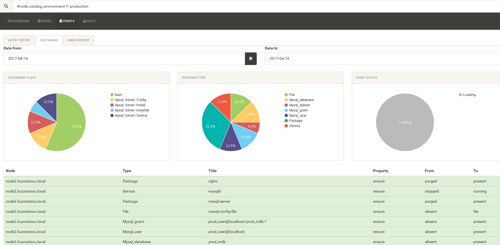
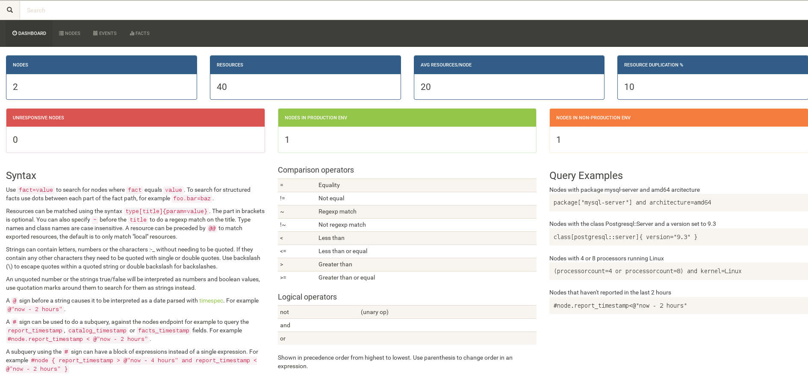

# lesson13

> **Table of contents:**

> - [**environments**][1] - directory with 2 environments for node1 and node2
> - [**manuals**][2] - dirctory with manuals 
> - [**vagrant_scripts**][3] - Vagrant directory of scripts for provisioning VMs
> - [**vagrant_shares**][4] - Vagrant directory of shares for VMs
> - [**Vagrantfile**][5] - Vagrantfile. Provisioning dns, master, node1, node2 VMs
> - [**[agent]-node1-puppet.conf**][6] - configuration file of puppet on node1
> - [**[agent]-node2-puppet.conf**][7] - configuration file of puppet on node2
> - [**puppet.conf**][8] - configuration file of puppet on master
> - [**puppetdb.conf**][9] - configuration file of puppetdb

> **Manuals** directory has 2 options of installation puppetdb and puppexplorer:
> - [Installing_puppetdb_and_puppetexplorer_as_modules.txt][10]
> - [Manual_installing_puppetdb_and_puppetexplorer.txt][11]

### Report of the node2.kuzniatsou.local.

### Main dashboard of the master1.kuzniatsou.local.

[1]: https://github.com/ngkuznetsov/lesson13/tree/mikalai_kuzniatsou/environments
[2]: https://github.com/ngkuznetsov/lesson13/tree/mikalai_kuzniatsou/manuals
[3]: https://github.com/ngkuznetsov/lesson13/tree/mikalai_kuzniatsou/vagrant_scripts
[4]: https://github.com/ngkuznetsov/lesson13/tree/mikalai_kuzniatsou/vagrant_shares
[5]: https://github.com/ngkuznetsov/lesson13/blob/mikalai_kuzniatsou/Vagrantfile
[6]: https://github.com/ngkuznetsov/lesson13/blob/mikalai_kuzniatsou/%5Bagent%5D-node1-puppet.conf
[7]: https://github.com/ngkuznetsov/lesson13/blob/mikalai_kuzniatsou/%5Bagent%5D-node2-puppet.conf
[8]: https://github.com/ngkuznetsov/lesson13/blob/mikalai_kuzniatsou/puppet.conf
[9]: https://github.com/ngkuznetsov/lesson13/blob/mikalai_kuzniatsou/puppetdb.conf
[10]: https://github.com/ngkuznetsov/lesson13/blob/mikalai_kuzniatsou/manuals/Manual_installing_puppetdb_and_puppetexplorer.txt
[11]: https://github.com/ngkuznetsov/lesson13/blob/mikalai_kuzniatsou/manuals/Manual_installing_puppetdb_and_puppetexplorer.txt
